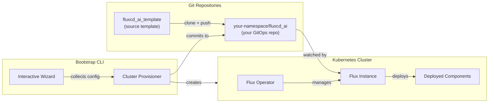
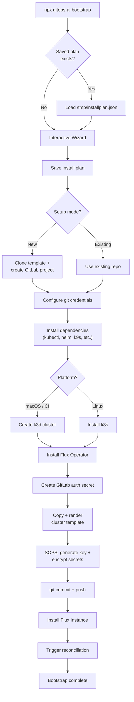
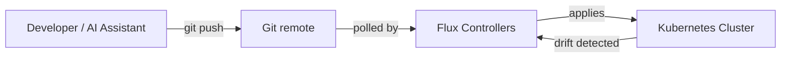
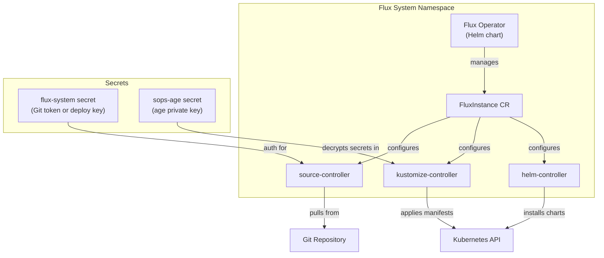

# System architecture

This document explains how the GitOps AI Bootstrapper works and the relationship between its components.

## Components

The system consists of two repositories and a Kubernetes cluster:



1. **Template repository** (`gitlab.com/everythings-gonna-be-alright/fluxcd_ai_template`) -- contains the default cluster layout, Helm values, and component manifests. You never modify this repo directly.

2. **Your GitOps repository** -- a fork/clone of the template, owned by your GitHub or GitLab namespace. This is the single source of truth for your cluster. All changes flow through Git. The repo includes `template-sync-metadata.yaml` (template semver and upstream coordinates); merging upstream updates is described in [Template synchronization](template-sync.md).

3. **Bootstrap CLI** (`gitops-ai`) -- the npm package you run. It clones the template, collects configuration, provisions the cluster, and installs Flux. After bootstrap, you rarely need it again.

## Bootstrap Flow



For a detailed walkthrough of each phase, see [Bootstrap Walkthrough](bootstrap.md).

## Repository structure

After bootstrap, your GitOps repository looks like this (names may match your repo and cluster name):

```text
your-gitops-repo/
├── .sops.yaml                          # SOPS encryption config (age public key)
├── template-sync-metadata.yaml         # Template version + upstream sync metadata
├── flux-instance-values.yaml           # Flux Instance Helm values
├── templates/                          # Shared bases (by category — not a Flux cluster path)
│   ├── system/                         # e.g. shared Helm repos, ingress
│   ├── monitoring/                     # e.g. Grafana, VictoriaMetrics
│   ├── ai/                             # e.g. OpenClaw, optional tooling
│   └── ...                             # homelab/, storage/, etc. as in upstream
├── clusters/
│   ├── _template/                      # Prototype snapshot from the template (reference; unchanged by Flux for your cluster)
│   │   └── ...
│   └── homelab/                        # Your cluster (clusterName from the wizard)
│       ├── cluster-sync.yaml           # Flux sync config with cluster variables
│       └── components/
│           ├── kustomization.yaml      # Component index
│           ├── shared-helm-repos/      # Helm chart repositories
│           ├── ingress-nginx-external/ # Ingress controller
│           ├── prometheus-operator-crds/
│           ├── cert-manager/           # TLS certificates (if enabled)
│           │   └── secret-cloudflare.yaml  # SOPS-encrypted
│           ├── external-dns/           # DNS automation (if enabled)
│           │   └── secret-cloudflare.yaml  # SOPS-encrypted
│           ├── grafana-operator/       # If monitoring enabled
│           ├── victoria-metrics-k8s-stack/
│           ├── flux-web/               # Flux dashboard (if enabled)
│           └── openclaw/               # AI gateway (if enabled)
│               └── secret-openclaw-envs.yaml  # SOPS-encrypted
```

Disabled components are removed entirely from **your** cluster directory -- their folders and `kustomization.yaml` entries are pruned during bootstrap.

To add Linux **k3s** nodes after bootstrap, see [Scaling](scaling.md).

## GitOps Reconciliation Loop

Once bootstrap is complete, Flux continuously reconciles the cluster state with Git:



1. **You push a change** to the GitOps repo (edit a HelmRelease, update values, add a component).
2. **Flux source-controller** polls the repo (default: every few minutes) and detects the new commit.
3. **Flux kustomize-controller** renders the Kustomization and applies resources. SOPS-encrypted secrets are decrypted in-memory using the age key stored in the cluster.
4. **Flux helm-controller** processes any HelmRelease changes, upgrading or installing Helm charts.
5. **Drift correction** -- if someone manually modifies a resource in the cluster, Flux reverts it to match Git on the next reconciliation cycle.

This means your Git repo is always the source of truth. You never `kubectl apply` manually -- every change goes through Git, giving you a full audit trail and the ability to roll back by reverting a commit.

## Flux Operator

A Helm chart installed into `flux-system` that acts as a Kubernetes controller. It watches for `FluxInstance` custom resources and manages the lifecycle of Flux controllers (source-controller, kustomize-controller, helm-controller, etc.).

## Flux Instance

A custom resource that tells the Flux Operator where your Git repository is and which branch to watch. The Flux Operator reads this CR and spins up the necessary Flux controllers configured to sync from your repo.


